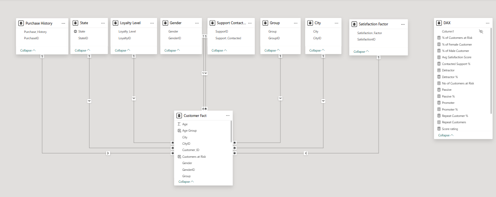
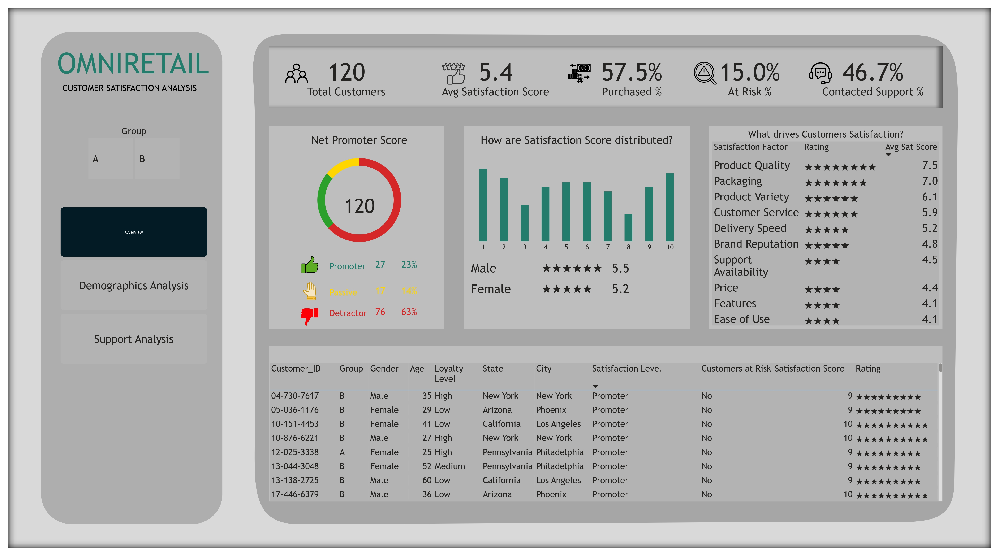
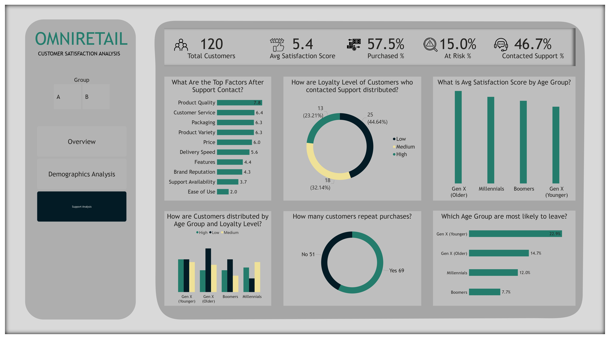

# 📊 OmniRetail: Customer Satisfaction Analysis Dashboard 

## 📌 Project Overview

This project analyzes customer satisfaction levels across various demographic and behavioral groups for a retail brand, **OmniRetail**. I use **Power BI** to identify trends in satisfaction, churn risk, support interactions, and loyalty levels using simulated survey data.

The report is divided into three key segments:  
- **Overview Dashboard**
- **Demographics Analysis**
- **Support Interaction Analysis**

---

## 📁 Project Files

| File | Description |
|------|-------------|
| `Customer_Satisfaction_Analysis.pbix` | Power BI project file |
| `Customer_Satisfaction_Report.pdf` | PDF export of full report |
| `assets/` | Folder containing screenshots and visuals |
| `README.md` | This file (project documentation) |

---

## 🧠 Business Questions Answered

- What drives customer satisfaction?
- Which age groups are most at risk of churn?
- How do loyalty levels vary across cities?
- What happens to satisfaction after contacting support?
- Which customers are most likely to repurchase?

---

## 📈 Key Metrics

| Metric | Value |
|--------|-------|
| Total Customers | 120 |
| Avg Satisfaction Score | 5.4 / 10 |
| Repeat Purchases | 57.5% |
| At-Risk Customers | 15.0% |
| Contacted Support | 46.7% |
| Net Promoter Score | 120 (23% Promoters, 63% Passives, 14% Detractors) |

---

## 🧩 Data Model

Here’s the star schema used to model the customer satisfaction data in Power BI:

- Fact Table: `Customer Fact`
- Dimension Tables: `Gender`, `Age Group`, `City`, `State`, `Loyalty Level`, `Support Contacted`, `Satisfaction Factor`, etc.
- Measures created with DAX (e.g., % At Risk, Avg Score, NPS)

---

## 🖼️ Dashboard Snapshots

### 🟩 Overview Page

---

### 🟨 Demographics Analysis

---

### 🟦 Support Analysis

---

## 🛠️ Tools Used

- **Power BI Desktop**
- **Microsoft Excel** (Data prep)
- **DAX** (Calculated metrics & KPIs)
- **Simulated data** (Customer behavior, satisfaction scores)

---

## 📌 Insights

- **Top Satisfaction Driver**: Product Quality (7.5)
- **Lowest Driver**: Ease of Use (4.1)
- **At-Risk Segment**: Gen X (Younger) – 22.9%
- **City Loyalty Split**: High loyalty in Chicago, Low in Los Angeles
- **Support Impact**: Satisfaction drops significantly after poor support

---

## 💼 How This Project Helps Business

- Improves understanding of **churn-prone groups**
- Prioritizes **product and service factors** to address
- Segments audience by **loyalty, geography, and age**
- Offers real-time insights to **boost retention and NPS**

---

## 📂 Folder Structure

